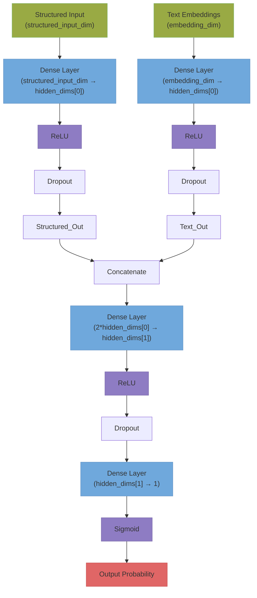

# **User Manual: G.R.O.O.T (Guided Readmission & Orchestrated Observation Text)**

Welcome to the comprehensive user manual for our **G.R.O.O.T (Guided Readmission & Orchestrated Observation Text)** and **Retrieval-Augmented Generation (RAG) Summaries** project. This manual aims to explain:

1. **Why** this project exists.  
2. **Who** can use it.  
3. **Why** we chose the MIMIC dataset.  
4. **Where** the data came from.  
5. **What** the entire code base does, **how** it does it, and **when** you might want to use certain features.  

We’ll keep the language straightforward and highlight motivations, folder structures, and code commentary extensively.

---

## **Contents**

1. Overview
2. Data
3. Folder Structure
4. Codex Manual
5. How to Use

---

## **1. Overview**

### **1.1 What Is This Project?**

- We want to **predict 30-day readmission risk** for patients by using a real-world medical dataset called **MIMIC** (Medical Information Mart for Intensive Care).
- We also incorporate a **RAG (Retrieval-Augmented Generation)** pipeline to provide **short text summaries** of the risk factors and best practices, leveraging **Local LLM** or **Hugging Face** models.

### **1.2 Why We Need This Project**

- **Hospitals** often care about which patients are more likely to come back (“readmitted”) within 30 days because it affects costs, patient health outcomes, and resource planning.
- By **predicting** who’s at high risk, doctors/nurses can intervene earlier, reduce complications, and **focus** on better care transitions.
- The **RAG Summaries** help automatically write a short note or plan about these risk factors, so clinicians can quickly see the main issues.

### **1.3 Who Can Use This Project**

1. **Medical Researchers**: They can try custom features, test readmission models, and refine knowledge-based summarization.
2. **Data Scientists**: They can learn how to do end-to-end ingestion, modeling, retrieval, and summarization with large language models (LLMs).
3. **Clinicians or IT Staff**: Potentially adapt the pipeline to see risk predictions for real patients (with the correct compliance and anonymization).
4. **Curious Learners**: Even someone new can run the pipeline, pick conditions, and see how the model responds.

### **1.4 Motivation for the Project**

- Real hospitals pay close attention to 30-day readmission rates (like for heart failure, sepsis, etc.). We want a **clinical decision support tool** that:
  1. Predicts readmission risk.  
  2. Summarizes key risk factors & guidelines to help clinicians or data scientists see **why** a patient might be readmitted.

---

## **2. Data**

### **2.1 What Is MIMIC?**

**MIMIC (Medical Information Mart for Intensive Care)** is a large, publicly available, de-identified clinical database developed by the MIT Lab for Computational Physiology. It contains detailed data from critical care units of the Beth Israel Deaconess Medical Center. Because the data is rigorously de-identified, researchers and data scientists worldwide use it to develop and evaluate algorithms in healthcare machine learning.

### **2.2 Origin of MIMIC**

- **MIMIC** is hosted on [PhysioNet.org](https://physionet.org/).  
- Anyone can sign up for an account, complete a short certification course on data usage, and then request access to the MIMIC dataset for research or educational purposes.

### **2.3 Why MIMIC Dataset?**

- **Breadth and Depth**: MIMIC includes **patient admissions**, **discharge summaries**, ICU chart events, lab data, and more, making it ideal for modeling real-world hospital scenarios.  
- **Free and Open**: Although you need credentialing, there’s no cost to access MIMIC once you’ve met the requirements, and the data is widely used in academic research.  
- **Rich in Clinical Variables**: The dataset spans multiple ICU stays, enabling the creation of advanced prediction tasks such as **30-day readmission** and **clinical summarization**.  
- **NLP-Friendly**: MIMIC provides **clinical notes** for tasks like discharge summary analysis, which we leverage to build an **NLP** pipeline for summarizing risk factors and recommended guidelines.

---

## **3. Folder & File Structure**

Here is a typical layout:

```text
groot
├── data
│   ├── knowledge_base
│   │   └── medical_knowledge.csv
│   ├── processed
│   └── raw
├── models
│   ├── baseline_xgb_model.json
│   └── fusion_model.pt
├── notebooks
│   └── EDA.ipynb
├── requirements.txt
├── src
│   ├── __init__.py
│   ├── config
│   │   ├── __init__.py
│   │   └── base_config.py
│   ├── data_processing
│   │   ├── __init__.py
│   │   ├── data_loader.py
│   │   ├── feature_engineering.py
│   │   ├── merge_embeddings.py
│   │   └── preprocess.py
│   ├── explainability
│   │   ├── __init__.py
│   │   └── explain.py
│   ├── modeling
│   │   ├── __init__.py
│   │   ├── baseline_model.py
│   │   ├── fusion_model.py
│   │   └── trainer.py
│   ├── nlp
│   │   ├── __init__.py
│   │   ├── domain_adaption.py
│   │   └── embed_clinical_texts.py
│   └── rag
│       ├── __init__.py
│       ├── build_index.py
│       └── generate_summaries.py
├── .gitignore
├── README.md
├── USER_MANUAL.md
├── app_fm.py
├── app_xgb.py
├── requirements.txt
├── base_structure.txt
└── structure.txt
```

After obtaining access and downloading the MIMIC-IV dataset, the typical dataset structure would look something like this:

```text
data
└── raw
│       ├── mimic-iv-note
│       │   └── 2.2
│       │       ├── LICENSE.txt
│       │       ├── SHA256SUMS.txt
│       │       ├── index.html
│       │       └── note
│       │           ├── discharge.csv.gz
│       │           ├── discharge_detail.csv.gz
│       │           ├── index.html
│       │           ├── radiology.csv.gz
│       │           └── radiology_detail.csv.gz
│       ├── mimiciv
│       │   └── 3.1
│       │       ├── CHANGELOG.txt
│       │       ├── LICENSE.txt
│       │       ├── SHA256SUMS.txt
│       │       ├── hosp
│       │       │   ├── admissions.csv.gz
│       │       │   ├── d_hcpcs.csv.gz
│       │       │   ├── d_icd_diagnoses.csv.gz
│       │       │   ├── d_icd_procedures.csv.gz
│       │       │   ├── d_labitems.csv.gz
│       │       │   ├── diagnoses_icd.csv.gz
│       │       │   ├── drgcodes.csv.gz
│       │       │   ├── emar.csv.gz
│       │       │   ├── emar_detail.csv.gz
│       │       │   ├── hcpcsevents.csv.gz
│       │       │   ├── index.html
│       │       │   ├── labevents.csv.gz
│       │       │   ├── microbiologyevents.csv.gz
│       │       │   ├── omr.csv.gz
│       │       │   ├── patients.csv.gz
│       │       │   ├── pharmacy.csv.gz
│       │       │   ├── poe.csv.gz
│       │       │   ├── poe_detail.csv.gz
│       │       │   ├── prescriptions.csv.gz
│       │       │   ├── procedures_icd.csv.gz
│       │       │   ├── provider.csv.gz
│       │       │   ├── services.csv.gz
│       │       │   └── transfers.csv.gz
│       │       ├── icu
│       │       │   ├── caregiver.csv.gz
│       │       │   ├── chartevents.csv.gz
│       │       │   ├── d_items.csv.gz
│       │       │   ├── datetimeevents.csv.gz
│       │       │   ├── icustays.csv.gz
│       │       │   ├── index.html
│       │       │   ├── ingredientevents.csv.gz
│       │       │   ├── inputevents.csv.gz
│       │       │   ├── outputevents.csv.gz
│       │       │   └── procedureevents.csv.gz
│       │       └── index.html
│       └── robots.txt
```

---

## **4. Codex Manual**

Now let's go through the codebase and how it was framed.

### **4.1 Environment and Configuration**

We can start by creating and activating a virtual environment ```venv``` in Python. To do this you can execute the following python script command in your terminal:

```bash
python3 -m venv .venv
source .venv/bin/activate
```

After the above command is executed, we are ready to install all the necessary libraries for this project using the requirements text file in the root of the repository. That can be initiated by executing the following command:

```bash
pip install -r requirements.txt
```

Next, let's focus on initializing a configuration file, which handles paths and constants that will be used throughout the project. This helps maintaining consistency and avoids hardcoding paths in multiple files.

File: ```src/config/base_config.py```

Here is how the code looks:

```python
# src/config/base_config.py

"""
This configuration file centralizes all constants, file paths, and parameters used across the project.
By changing these values here, we can easily adjust our pipeline without editing multiple scripts.
"""

import os

ROOT_DIR = os.path.abspath(os.path.join(os.path.dirname(__file__), "../../"))

RAW_DATA_DIR = os.path.join(ROOT_DIR, "data", "raw")
PROCESSED_DATA_DIR = os.path.join(ROOT_DIR, "data", "processed")
MODELS_DIR = os.path.join(ROOT_DIR, "models")
ADMISSIONS_FILE = os.path.join(RAW_DATA_DIR, "mimiciv/3.1/hosp/admissions.csv.gz")
PATIENTS_FILE = os.path.join(RAW_DATA_DIR, "mimiciv/3.1/hosp/patients.csv.gz")
DIAGNOSES_FILE = os.path.join(RAW_DATA_DIR, "mimiciv/3.1/hosp/diagnoses_icd.csv.gz")
NOTES_FILE = os.path.join(RAW_DATA_DIR, "mimic-iv-note/2.2/note/discharge.csv.gz")

TARGET_READMISSION_DAYS = 30  
TEST_SIZE = 0.2  
RANDOM_SEED = 42
```

**Explanation**:

- ```ROOT_DIR``` is computed dynamically, ensuring we can run scripts from anywhere.

- ```RAW_DATA_DIR``` and ```PROCESSED_DATA_DIR``` define where we store data at various stages.

- Paths like ```ADMISSIONS_FILE``` and ```PATIENTS_FILE``` point to actual MIMIC CSV files. You must have MIMIC data placed in ```data/raw/``` as instructed in the previous section.

- Constants like ```TARGET_READMISSION_DAYS``` are central to our problem definition.

- ```TEST_SIZE``` and ```RANDOM_SEED``` will be used for splitting data and ensuring reproducibility.

### **4.2 Data Acquisition and Preprocessing**

#### **4.2.1 Data Loader**

Here is the data loader script, this scripts basically:

1. Check if the MIMIC data files exist
2. Load the CSV files into the memory using ```pandas```.
3. Does minimal preprocessing (like selecting needed columns).

File: ```src/data_processing/data_loader.py```

```python
# src/data_processing/data_loader.py

"""
This script is responsible for loading raw MIMIC data into memory.
It provides functions to load admissions, patients, diagnoses, and notes data.
We want to ensure that each function just focuses on loading and returning raw DataFrames.
All heavy preprocessing will be done in separate scripts to keep responsibilities separate.
"""

import os
import pandas as pd
from src.config.base_config import (
    ADMISSIONS_FILE,
    PATIENTS_FILE,
    DIAGNOSES_FILE,
    NOTES_FILE
)

def load_admissions() -> pd.DataFrame:
    """
    Load the admissions table from MIMIC dataset.
    
    Returns:
        pd.DataFrame: The admissions data.
    """
    # Check if file exists before loading
    if not os.path.exists(ADMISSIONS_FILE):
        raise FileNotFoundError(f"Admissions file not found at {ADMISSIONS_FILE}")
    
    df = pd.read_csv(ADMISSIONS_FILE, compression='gzip')
    return df

def load_patients() -> pd.DataFrame:
    """
    Load the patients table from MIMIC dataset.
    
    Returns:
        pd.DataFrame: The patients data.
    """
    if not os.path.exists(PATIENTS_FILE):
        raise FileNotFoundError(f"Patients file not found at {PATIENTS_FILE}")
    
    df = pd.read_csv(PATIENTS_FILE, compression='gzip')
    return df

def load_diagnoses() -> pd.DataFrame:
    """
    Load the diagnoses table from MIMIC dataset.
    
    Returns:
        pd.DataFrame: The diagnoses data.
    """
    if not os.path.exists(DIAGNOSES_FILE):
        raise FileNotFoundError(f"Diagnoses file not found at {DIAGNOSES_FILE}")
    
    df = pd.read_csv(DIAGNOSES_FILE, compression='gzip')
    return df

def load_notes() -> pd.DataFrame:
    """
    Load the notes (clinical notes) from MIMIC dataset.
    
    Returns:
        pd.DataFrame: The notes data.
    """
    if not os.path.exists(NOTES_FILE):
        raise FileNotFoundError(f"Notes file not found at {NOTES_FILE}")
    
    df = pd.read_csv(NOTES_FILE, compression='gzip')
    return df
```

**Explanation**:

- Each loader function checks if the file exists. This is usually a good practice for error handling.

- ```pd.read_csv(..., compression='gzip')```: MIMIC data often is gzipped. This handle is automatic.

- Each function returns a pandas Dataframe. We do no processing here, just loading.

#### **4.2.2 Preprocessing Script**

Here we define the logic to merge tables, create the outcome variable (30-day readmission), and do initial cleaning. For instance here, we create a cohort from patirnts admitted for certain conditions, or just select the relevant columns.

File: ```src/data_processing/preprocess.py```

```python
# src/data_processing/preprocess.py

"""
This script takes raw MIMIC-IV tables and preprocesses them into a cleaned,
analysis-ready dataset for 30-day readmission prediction.
"""

import pandas as pd
import os
from datetime import timedelta
from src.config.base_config import (
    PROCESSED_DATA_DIR,
    TARGET_READMISSION_DAYS,
    RANDOM_SEED
)
from src.data_processing.data_loader import load_admissions, load_patients, load_diagnoses

def create_cohort() -> pd.DataFrame:
    """
    Create a cohort of patients and admissions suitable for predicting 30-day readmission.
    
    Steps:
    1. Load admissions, patients, and diagnoses data (MIMIC-IV).
    2. Merge into a single DataFrame keyed by admission (hadm_id).
    3. Sort admissions by admittime per subject_id to find subsequent admissions.
    4. Determine if a given admission is followed by another admission within 30 days.
    5. Return a cleaned DataFrame with a binary target for readmission.
    
    Returns:
        pd.DataFrame: DataFrame with patient/admission-level features and 'readmitted_within_30d' target.
    """
    # 1. Load data
    admissions = load_admissions()  # must have columns ['subject_id', 'hadm_id', 'admittime', 'dischtime']
    patients = load_patients()      # must have columns like ['subject_id', 'anchor_age', 'gender']
    diagnoses = load_diagnoses()    # must have columns ['subject_id', 'hadm_id', 'icd_code', ...]

    # 2. Convert admission times to datetime
    admissions['admittime'] = pd.to_datetime(admissions['admittime'])
    admissions['dischtime'] = pd.to_datetime(admissions['dischtime'])

    # 3. Merge patient info (we'll keep anchor_age and gender as example features)
    # In MIMIC-IV, 'anchor_age' is the approximate age at first admission.
    # 'gender' can be 'M' or 'F'.
    merged = admissions.merge(
        patients[['subject_id', 'anchor_age', 'gender']], 
        on='subject_id', 
        how='left'
    )

    # 4. Incorporate diagnoses
    # diagnoses_icd.csv.gz in MIMIC-IV often uses 'icd_code' (and 'icd_version')
    # If your file uses 'icd9_code', adjust the line below to match.
    diag_counts = diagnoses.groupby('hadm_id')['icd_code'].count().reset_index()
    diag_counts.rename(columns={'icd_code': 'num_diagnoses'}, inplace=True)
    merged = merged.merge(diag_counts, on='hadm_id', how='left')

    # 5. Sort to find subsequent admissions
    merged = merged.sort_values(by=['subject_id', 'admittime'])

    # 6. Create the 30-day readmission target
    merged['next_admittime'] = merged.groupby('subject_id')['admittime'].shift(-1)
    merged['readmitted_within_30d'] = (
        (merged['next_admittime'] - merged['dischtime']) <= timedelta(days=TARGET_READMISSION_DAYS)
    ).astype(int)

    # For the last admission of each patient, there's no "next_admittime"; fill with 0
    merged['readmitted_within_30d'].fillna(0, inplace=True)

    return merged

def save_processed_data(df: pd.DataFrame, filename="processed_cohort.csv"):
    """
    Save the processed DataFrame to the processed directory.
    """
    os.makedirs(PROCESSED_DATA_DIR, exist_ok=True)
    output_path = os.path.join(PROCESSED_DATA_DIR, filename)
    df.to_csv(output_path, index=False)
    print(f"Processed data saved to {output_path}")

if __name__ == "__main__":
    # Running this script directly will create and save the cohort.
    df = create_cohort()
    print("Target Distribution:\n", df['readmitted_within_30d'].value_counts())
    save_processed_data(df)
```

**Explanation**:

- ```def create_cohort()```: Main function to create the aalysis-ready data.

- ```load_admissions()```, ```load_patients()```, ```load_diagnoses()``` are all called to bring in raw data.

- ```pd.datetime(...)```: Converts the datetime data to a proper timestamp objects for better reperesentation and calculations.

- ```merged = admissions.merge(patients['...'])```: Merging patient level demographics with admission-level records.

- ```diag_counts = diagnoses.groupby('hadm_id')['icd_code'].count()```: Feature engineering - count the number of diagnosis codes per admission as simple complexity measure.

- Sorting by ```admittime``` lets us identify subsequent admission records.

- Comparing ```readmitted_with_30d``` with the difference of ```next_admittime``` and ```dischtime``` is the key step to defining our target variable.

- ```save_processed_df()``` stores the dataframe onto the disk. It is usually best to keep I/O seperated from data processing logic.

### **4.3 Exploratory Data Analysis (EDA)**

```python
import pandas as pd
import matplotlib.pyplot as plt
import seaborn as sns
from IPython.display import display
import os

DATA_PATH = os.path.abspath(os.path.join("..", "data", "processed", "processed_cohort.csv"))
df = pd.read_csv(DATA_PATH)

display(df.head())
display(df.info())
display(df.describe())
```

This would give a quick sneak peak of the dataset of interest(MIMIC-IV). Next, we take a look at the target distribution.

```python
target_counts = df['readmitted_within_30d'].value_counts()
print("Target Distribution:")
display(target_counts)
```

This would provide the number of entries of readmission and also number of entries of no-readmission. We can also visualize ths using a bar graph.

```python
sns.countplot(x='readmitted_within_30d', data=df)
plt.title("Target Distribution (Readmission within 30 days)")
plt.show()
```

We can also take a look at the percentages of missing values in the data by categories/columns.

```python
missing_perc = df.isna().mean().sort_values(ascending=False)
print("Missing values percentage:")
display(missing_perc)
```

We can also visualize the distribution of readmission status across different age groups.

```python
df['age_at_admission'] = df['anchor_age']
sns.histplot(data=df, x='age_at_admission', hue='readmitted_within_30d', element='step', kde=True)
plt.title("Age Distribution by Readmission Status")
plt.show()
```

We could also visualize distribution of readmission across genders(we only considered two genders as that was what was available in MIMIC-IV).

```python
sns.countplot(x='gender', hue='readmitted_within_30d', data=df)
plt.title("Gender vs Readmission")
plt.show()
```

Finally, we could visualize the distribution of readmissions across the number of diagnoses.

```python
sns.histplot(data=df, x='num_diagnoses', hue='readmitted_within_30d', kde=True, element='step')
plt.title("Number of Diagnoses vs Readmission")
plt.show()
```

**Explanation**:

- We load the processes dataset and perform standard EDA tasks.

- We look at the distributions, missing values, and simple relationships with the target.

- Insights here did guide what features to create and ways to handle missing data.

### **4.4 Feature Engineering**

Here we have created a reproducible script to handle feature transformation. After EDA, we apply those feature transformations that were determined fom it.

File: ```src/data_processing/feature_engineering.py```

```python
# src/data_processing/feature_engineering.py

"""
This script applies feature transformations for MIMIC-IV data.
We assume we have a processed_cohort.csv with columns like:
  [
    'subject_id', 'hadm_id', 'admittime', 'dischtime', 'anchor_age',
    'gender', 'num_diagnoses', 'readmitted_within_30d', 'next_admittime'
  ]

Steps:
1. Create an AGE_AT_ADMISSION feature (simplified to anchor_age).
2. Handle missing values in NUM_DIAGNOSES by filling with 0.
3. Encode gender as binary (0/1).
4. Save a final feature set ready for modeling.
"""

import os
import pandas as pd
import numpy as np
from src.config.base_config import PROCESSED_DATA_DIR

def engineer_features(input_filename="processed_cohort.csv", output_filename="final_features.csv"):
    input_path = os.path.join(PROCESSED_DATA_DIR, input_filename)
    if not os.path.exists(input_path):
        raise FileNotFoundError(f"{input_filename} not found in {PROCESSED_DATA_DIR}")

    # For MIMIC-IV, 'admittime' and 'dischtime' are typically already in datetime if you created them in preprocess.py
    # We'll parse them again just in case, ignoring errors if they're already datetimes.
    df = pd.read_csv(input_path, parse_dates=['admittime', 'dischtime', 'next_admittime'], keep_default_na=True)

    # --- 1. AGE_AT_ADMISSION Feature ---
    # MIMIC-IV does not have a direct DOB. Instead, we have anchor_age (approximate age at first admission).
    # For a simple approach, just use anchor_age as the age feature.
    # If you need a more precise age per admission, you could approximate by anchor_year vs admittime year, etc.
    df['age_at_admission'] = df['anchor_age']

    # Handle unrealistic ages (some might be > 90 due to deidentification policy).
    # This step is optional. You might choose to leave them as-is or clamp them.
    df.loc[df['age_at_admission'] > 90, 'age_at_admission'] = 90

    # --- 2. Missing Values for num_diagnoses ---
    # In MIMIC-IV, the script may have named it 'num_diagnoses' already.
    # If your code uses a different name, adjust accordingly.
    if 'num_diagnoses' in df.columns:
        df['num_diagnoses'] = df['num_diagnoses'].fillna(0)
    else:
        df['num_diagnoses'] = 0  # fallback if not present

    # --- 3. Encode Gender (M/F -> 0/1) ---
    # MIMIC-IV typically uses 'gender' with values "M" or "F".
    if 'gender' in df.columns:
        df['gender_encoded'] = df['gender'].map({'M': 0, 'F': 1})
        df.drop(columns=['gender'], inplace=True)
    else:
        df['gender_encoded'] = 0

    # --- 4. Remove Unneeded Columns ---
    # We remove columns we won't use in modeling, like raw times or anchor_age itself
    # (you can keep them if you want to do time-based features).
    # We'll keep 'hadm_id', 'subject_id', and 'readmitted_within_30d' for reference.
    drop_cols = [
        'admittime', 
        'dischtime', 
        'next_admittime', 
        'anchor_age'
    ]
    for col in drop_cols:
        if col in df.columns:
            df.drop(columns=[col], inplace=True)

    # Save the engineered features
    output_path = os.path.join(PROCESSED_DATA_DIR, output_filename)
    df.to_csv(output_path, index=False)
    print(f"Feature-engineered dataset saved to {output_path}")

if __name__ == "__main__":
    engineer_features()
```

**Explanation**:

- ```engineer_features()``` function reads the procesed data and applies transformations consistently.

- we add ```age_at_admission```, we handle missing values in ```num_diagnoses```, we encode gender as a numeric column and also drop columns not needed for baseline modeling.

- we save the finalized feature dataset (```final_features.csv```) ready for model training.

This script can be run to ensure reproducible feature engineering. If you'd like to find more complex features through EDA (like trend features from labs and vitals), you'd implement them here.

### **4.5 Baseline Modeling(Structure Data Only)**

We have set up a baseline model using XGBoost just to have a quick benchmark. It's pretty simple: trained on engineered features just to gauge how well we can predict readmission.

File: ```src/modeling/baseline_model.py```

```python
# src/modeling/baseline_model.py

"""
This script trains a baseline model (e.g., XGBoost) on the structured features.
Steps:
1. Load final_features.csv
2. Split into train/test.
3. Train an XGBoost model on these features.
4. Evaluate and print performance metrics.
"""

import os
import pandas as pd
from sklearn.model_selection import train_test_split
from sklearn.metrics import roc_auc_score, accuracy_score, classification_report
import xgboost as xgb

from src.config.base_config import PROCESSED_DATA_DIR, RANDOM_SEED, TEST_SIZE

def train_baseline_model(input_filename="final_features.csv"):
    input_path = os.path.join(PROCESSED_DATA_DIR, input_filename)
    if not os.path.exists(input_path):
        raise FileNotFoundError(f"{input_filename} not found in {PROCESSED_DATA_DIR}")

    df = pd.read_csv(input_path)
    
    # Separate features and target
    X = df.drop(columns=['readmitted_within_30d'])
    cols_to_drop = ["deathtime", "admit_provider_id", "discharge_location", "edregtime", "edouttime"]
    X = X.drop(columns=cols_to_drop, errors='ignore')
    X = pd.get_dummies(X, columns=["admission_type", "admission_location", "insurance", "language", "marital_status", "race"],drop_first=True)
    y = df['readmitted_within_30d']

    # Train/test split
    X_train, X_test, y_train, y_test = train_test_split(X, y, test_size=TEST_SIZE, random_state=RANDOM_SEED, stratify=y)

    # Convert to DMatrix for XGBoost
    dtrain = xgb.DMatrix(X_train, label=y_train)
    dtest = xgb.DMatrix(X_test, label=y_test)

    # Basic hyperparameters for a quick baseline
    params = {
        'objective': 'binary:logistic',
        'eval_metric': 'auc',
        'seed': RANDOM_SEED
    }

    # Train model
    evals = [(dtrain, 'train'), (dtest, 'eval')]
    model = xgb.train(params, dtrain, num_boost_round=100, early_stopping_rounds=10, evals=evals)

    # Predictions
    y_pred_prob = model.predict(dtest)
    y_pred = (y_pred_prob > 0.5).astype(int)

    # Evaluate
    auc = roc_auc_score(y_test, y_pred_prob)
    acc = accuracy_score(y_test, y_pred)
    report = classification_report(y_test, y_pred)

    print(f"Baseline Model AUC: {auc:.4f}")
    print(f"Baseline Model Accuracy: {acc:.4f}")
    print("Classification Report:")
    print(report)

    # Save the model
    model.save_model(os.path.join(PROCESSED_DATA_DIR, "baseline_xgb_model.json"))
    print("Model saved.")

if __name__ == "__main__":
    train_baseline_model()
```

**Explanation**:

- We loaded the engineered feature set, split the data into train/test.

- We then trained a simple XGBoost model (other models like LightGBM or Logistic Regression can be used similarly).

- We print AUC, accuracy and a classification report to gauge performance and then save the trained model for comparison.

This baseline will help us understand if adding text embeddings or further domain adaptation steps that'd potentially improve performance.

### **4.6 NLP Integration: Embedding Discharge Summaries**

File: ```src/nlp/embed_clinical_texts.py```

```python
# src/nlp/embed_clinical_texts.py

"""
This script:
1. Loads the MIMIC NOTEEVENTS data.
2. Filters for discharge summaries linked to the admissions in our cohort.
3. Uses ClinicalBERT to embed these discharge summaries.
4. Produces a CSV (or parquet) file mapping hadm_id to embedding vectors.

We will:
- Load a pre-trained ClinicalBERT model from Hugging Face (e.g., "emilyalsentzer/Bio_ClinicalBERT").
- Tokenize each discharge summary.
- Obtain embeddings (CLS token or average pooling of token embeddings).
- Save a DataFrame with hadm_id and the embedding vector.
"""

import os
import pandas as pd
import torch
from transformers import AutoModel, AutoTokenizer
from src.config.base_config import PROCESSED_DATA_DIR
from src.data_processing.data_loader import load_notes

def embed_texts(model_name="fine_tuned_clinicalbert_mlm", 
                output_filename="discharge_embeddings.parquet",
                max_length=512,
                batch_size=16):
    """
    Embed discharge summaries using ClinicalBERT.
    
    Steps:
    - Load NOTEEVENTS and filter to discharge summaries.
    - For each hadm_id, possibly combine multiple discharge summaries if they exist (usually one per admission).
    - Tokenize and run through model in batches.
    - Extract embeddings (use CLS token representation or average of last hidden state).
    - Save results.
    """
    # Load notes
    discharge_summaries = load_notes()
    
    # Filter to discharge summaries (only in MIMIC-III)
    # discharge_summaries = notes_df[notes_df['CATEGORY'] == 'Discharge summary'].copy()
    
    # We assume each hadm_id has one main discharge summary. If multiple rows exist, concatenate text.
    discharge_summaries = discharge_summaries.groupby('hadm_id')['text'].apply(lambda x: " ".join(x)).reset_index()

    # Load the ClinicalBERT model and tokenizer
    tokenizer = AutoTokenizer.from_pretrained(model_name)
    model = AutoModel.from_pretrained(model_name)
    
    # Decide on device (CPU or GPU)
    device = torch.device("mps") if torch.backends.mps.is_available() else "cpu"
    model.to(device)
    model.eval()

    hadm_ids = discharge_summaries['hadm_id'].values
    texts = discharge_summaries['text'].values

    # Tokenize in batches
    # Note: If texts are very long, consider truncation or summarization.
    embeddings = []
    for start_idx in range(0, len(texts), batch_size):
        batch_texts = texts[start_idx:start_idx+batch_size]
        batch_texts = batch_texts.tolist()
        encoded = tokenizer.batch_encode_plus(batch_texts, padding=True, truncation=True, max_length=max_length,return_tensors='pt')
        encoded = {k: v.to(device) for k,v in encoded.items()}

        with torch.inference_mode():
            outputs = model(**encoded)
            # outputs.last_hidden_state: [batch_size, seq_len, hidden_size]
            # We can take the CLS token representation (index 0)
            cls_embeddings = outputs.last_hidden_state[:,0,:]  # shape: [batch_size, hidden_size]
            cls_embeddings = cls_embeddings.to("mps")

        cls_embeddings = cls_embeddings.to("cpu").numpy()
        embeddings.append(cls_embeddings)

    # Concatenate all batches
    embeddings = pd.DataFrame(
        data = torch.tensor([item for batch in embeddings for item in batch]).numpy(),
        index = hadm_ids
    )
    embeddings.reset_index(inplace=True)
    embeddings.rename(columns={'index': 'hadm_id'}, inplace=True)

    # Save embeddings
    output_path = os.path.join(PROCESSED_DATA_DIR, output_filename)
    embeddings.to_parquet(output_path, index=False)
    print(f"Discharge embeddings saved to {output_path}")

if __name__ == "__main__":
    embed_texts()
```

**Explanation**:

- We loaded discharge summaries, gruped by ```hadm_id```.

- We used ```AutoTokenizer``` and ```AutoModel``` from ```transformers``` to load ```Bio_ClinicalBERT```.

- We batch processed texts to avoid memory issues, we also selected CLS token embedding as ou document-level embedding. Other proposed strategies: averaging all tokens or using pooling.

- We saved the final embeddings as a parquet file for efficiency.

**Performance Considerations**:

- ```max_length=512``` might truncate some long summaries, but ClinicalBERT models typically handle up to 512 tokens.

- We used ```mps``` acceleration in order to make up for the speed of a GPU level environment. In case you need to run it on a CPU, you can reduce the ```batch_size```, and try running it again.

### **4.7 Merging Embeddings with Structured Features**

After generating embeddings, we must merge them with our ```final_features.csv```. This gave us a single dataset with structured features plus text embeddings.

File: ```src/data_processing/merge_embeddings.py```

```python
# src/data_processing/merge_embeddings.py

"""
Merge the previously engineered structured features with the discharge summary embeddings.

We assume:
- final_features.csv has hadm_id column.
- discharge_embeddings.parquet has columns [hadm_id, embedding_dim_1, ... embedding_dim_n].

We will:
- Load both files,
- Merge on hadm_id,
- Save a combined dataset for modeling.
"""

import os
import pandas as pd
from src.config.base_config import PROCESSED_DATA_DIR

def merge_embeddings(structured_file="final_features.csv", embeddings_file="discharge_embeddings.parquet", output_file="features_with_embeddings.csv"):
    structured_path = os.path.join(PROCESSED_DATA_DIR, structured_file)
    embeddings_path = os.path.join(PROCESSED_DATA_DIR, embeddings_file)
    
    if not os.path.exists(structured_path):
        raise FileNotFoundError(f"{structured_file} not found.")
    if not os.path.exists(embeddings_path):
        raise FileNotFoundError(f"{embeddings_file} not found.")

    df_struct = pd.read_csv(structured_path)
    df_embed = pd.read_parquet(embeddings_path)

    # Merge on hadm_id
    df_merged = df_struct.merge(df_embed, on='hadm_id', how='left')
    
    # Some admissions might not have a discharge summary (or embedding)
    # We can either drop them or impute embeddings as zeros.
    # For simplicity, fill missing embeddings with 0:
    embedding_cols = [c for c in df_merged.columns if c not in df_struct.columns and c != 'hadm_id']
    for col in embedding_cols:
        df_merged[col].fillna(0, inplace=True)

    # Save merged dataset
    output_path = os.path.join(PROCESSED_DATA_DIR, output_file)
    df_merged.to_csv(output_path, index=False)
    print(f"Features with embeddings saved to {output_path}")

if __name__ == "__main__":
    merge_embeddings()
```

**Explanation**:

- We merged on ```hadm_id``` to align each admission's structured features with its text embedding.

- We also handled missing embeddings by filling with zeros (a simple approach).

- The resulting file includes both structured features and text embeddings, ready for modeling.

### **4.8 Domain Adaptation (PEFT)**

We outlined a sceipt to perform parameter-efficient fine-tuning on a subset of notes. This allowed us to adapt the ClinicalBERT modl to the readmission prediction domain. the idea is to take some of the discharge summaries (and possibly labels or related tasks) and apply LoRA or other PEFT methods to refine embeddings.

**Note**: Running domain adaptation requires intricate steps: a small training loop, a labeled objective, or at least a domain adaptation objective (like masked language modeling on domain data).

File: ```src/nlp/domain_adaption.py```

```python
# src/nlp/domain_adaptation_mlm.py (Option 2)

"""
Option 2: Standard MLM fine-tuning for domain adaptation with BertForMaskedLM,
without using PEFT. 
You can optionally freeze certain layers to reduce compute.
"""

import os
import torch
from transformers import (
    AutoModelForMaskedLM,
    AutoTokenizer,
    DataCollatorForLanguageModeling,
    Trainer,
    TrainingArguments
)
from datasets import Dataset


def domain_adapt_model_mlm(
    model_name="emilyalsentzer/Bio_ClinicalBERT",
    output_dir="fine_tuned_clinicalbert_mlm",
    max_length=512,
    num_train_epochs=1,
    batch_size=8
):
    # 1. Load tokenizer and model
    tokenizer = AutoTokenizer.from_pretrained(model_name)
    model = AutoModelForMaskedLM.from_pretrained(model_name)

    # (Optional) Partial Freeze Example:
    for name, param in model.named_parameters():
        if "bert.encoder.layer.0" in name or "bert.encoder.layer.1" in name:
            param.requires_grad = False

    # 2. Load domain texts (e.g., discharge notes). Customize as needed: e.g. from MIMIC, let's just say we have a function load_notes() that returns a list of text. Below is a placeholder.
    from src.data_processing.data_loader import load_notes
    domain_texts = load_notes()  # list of strings or a DataFrame with a 'text' column

    domain_texts = domain_texts['text'].tolist()

    domain_dataset = Dataset.from_dict({'text': domain_texts})

    # 3. Tokenize
    def tokenize_function(examples):
        return tokenizer(
            examples['text'], 
            truncation=True, 
            max_length=max_length, 
            return_special_tokens_mask=True
        )

    tokenized_dataset = domain_dataset.map(tokenize_function, batched=True, num_proc=1)

    # 4. Data Collator for MLM
    data_collator = DataCollatorForLanguageModeling(
        tokenizer=tokenizer, 
        mlm=True,
        mlm_probability=0.15
    )

    # 5. Training Arguments
    training_args = TrainingArguments(
        output_dir=output_dir,
        overwrite_output_dir=True,
        num_train_epochs=num_train_epochs,
        per_device_train_batch_size=batch_size,
        save_steps=10_000,
        save_total_limit=2,
        logging_steps=100,
        logging_dir=f"{output_dir}/logs",
        do_train=True
    )

    # 6. Trainer
    trainer = Trainer(
        model=model,
        args=training_args,
        train_dataset=tokenized_dataset,
        data_collator=data_collator
    )

    # 7. Train
    trainer.train()

    # 8. Save Model
    trainer.save_model(output_dir)
    tokenizer.save_pretrained(output_dir)
    print(f"Domain-adapted model (MLM) saved to {output_dir}")
    

if __name__ == "__main__":
    domain_adapt_model_mlm()
```

**Explanation**:

- We apply LoRA-based fine-tuning via ```peft```. This code uses a masked language modeling objective to adapt the model to the domain.

- After training, we got a model that's more aligned with MIMIC data, potentially producing better embeddings.

- We then re-run ```embed_clinical_texts.py``` with the fine-tuned model to get domain-daptation embeddings.

### **4.9 Fusion Model**

File: ```src/modeling/fusion_model.py```

```python
# src/modeling/fusion_model.py

"""
Defines the Fusion Model:
1. Combines structured features and text embeddings.
2. Uses fully connected layers for prediction.
"""

import torch
import torch.nn as nn

class FusionModel(nn.Module):
    """
    Fusion model combining structured features and text embeddings for classification.
    """
    def __init__(self, structured_input_dim, embedding_dim, hidden_dims, dropout_rate=0.2):
        """
        Args:
            structured_input_dim (int): Number of structured input features.
            embedding_dim (int): Size of text embedding vectors.
            hidden_dims (list): List of hidden layer sizes for the feed-forward network.
            dropout_rate (float): Dropout rate for regularization.
        """
        super(FusionModel, self).__init__()
        
        # Separate branches for structured and text embeddings
        self.structured_branch = nn.Sequential(
            nn.Linear(structured_input_dim, hidden_dims[0]),
            nn.ReLU(),
            nn.Dropout(dropout_rate)
        )
        
        self.text_branch = nn.Sequential(
            nn.Linear(embedding_dim, hidden_dims[0]),
            nn.ReLU(),
            nn.Dropout(dropout_rate)
        )
        
        # Combined branch
        self.combined_branch = nn.Sequential(
            nn.Linear(2 * hidden_dims[0], hidden_dims[1]),
            nn.ReLU(),
            nn.Dropout(dropout_rate),
            nn.Linear(hidden_dims[1], 1),
            nn.Sigmoid()
        )
    
    def forward(self, structured_inputs, text_embeddings):
        """
        Forward pass for the model.
        
        Args:
            structured_inputs (torch.Tensor): Structured input features [batch_size, structured_input_dim].
            text_embeddings (torch.Tensor): Text embeddings [batch_size, embedding_dim].
        
        Returns:
            torch.Tensor: Predicted probabilities for binary classification.
        """
        structured_out = self.structured_branch(structured_inputs)
        text_out = self.text_branch(text_embeddings)
        
        combined = torch.cat((structured_out, text_out), dim=1)
        output = self.combined_branch(combined)
        
        return output
```

### **4.10 Explainability with SHAP**

File: ```src/explainability/explain.py```

```python
# src/explainability/explain.py

"""
Use SHAP to explain model predictions.
We will:
1. Load the trained model and the final dataset with embeddings.
2. Split into test data as previously done.
3. Compute SHAP values.
4. Save a summary plot or a few example explanations.

Note: SHAP can be computationally expensive, so consider using a sample of test data.
"""

import os
import pandas as pd
import shap
import matplotlib.pyplot as plt
import xgboost as xgb
from sklearn.model_selection import train_test_split
from src.config.base_config import PROCESSED_DATA_DIR, TEST_SIZE, RANDOM_SEED

def generate_shap_values(input_filename="features_with_embeddings.csv", model_filename="baseline_xgb_model.json"):
    # Load data
    input_path = os.path.join(PROCESSED_DATA_DIR, input_filename)
    model_path = os.path.join(PROCESSED_DATA_DIR, model_filename)

    if not os.path.exists(input_path):
        raise FileNotFoundError(f"{input_filename} not found in {PROCESSED_DATA_DIR}")
    if not os.path.exists(model_path):
        raise FileNotFoundError(f"{model_filename} not found in {PROCESSED_DATA_DIR}")

    df = pd.read_csv(input_path)
    X = df.drop(columns=['readmitted_within_30d'])
    cols_to_drop = ["deathtime", "admit_provider_id", "discharge_location", "edregtime", "edouttime"]
    X = X.drop(columns=cols_to_drop, errors='ignore')
    X = pd.get_dummies(X, columns=["admission_type", "admission_location", "insurance", "language", "marital_status", "race"],drop_first=True)
    y = df['readmitted_within_30d']

    X_train, X_test, y_train, y_test = train_test_split(X, y, test_size=TEST_SIZE, random_state=RANDOM_SEED, stratify=y)
    
    # Load model
    model = xgb.Booster()
    model.load_model(model_path)
    feature_names = model.feature_names
    X_test = X_test.reindex(columns=feature_names)
    # SHAP values for XGBoost
    # Convert data to DMatrix
    dtest = xgb.DMatrix(X_test)

    # Create a SHAP explainer
    explainer = shap.TreeExplainer(model)
    shap_values = explainer.shap_values(X_test)

    # Save shap values if needed, or directly create a summary plot
    shap.summary_plot(shap_values, X_test, show=False)
    # To save the plot, you can do:
    shap_plot_path = os.path.join(PROCESSED_DATA_DIR, "shap_summary_post_da.png")
    plt.savefig(shap_plot_path)
    print(f"SHAP summary plot saved at {shap_plot_path}")

if __name__ == "__main__":
    generate_shap_values()
```

**Explanation**:

- We load the trained model and test data.

- We used ```shap.TreeExplainer``` for XGBoost models. This computes the SHAP values and creates a summary plot.

- Individua explanations can be investigated or top features that contributes to predictions can be found.

### **4.11 Retrieval-Augmented Generation (RAG)**

#### **Outline**

- We created a small Knowledge Base (KB) of medical facts. It's all encapsulated in a ```csv``` file with short medical condition summaries or guidelines.

- We also embedded the KB using a specialized embedding model (e.g., a sentence transformer). We also used FAISS to index these embeddings.

- At inference time, given a patient's structured and textual data, we:

  - Identified key conditions from their diagnoses or risk factors.

  - Queried FAISS to retrieve the most relevant snippets.

  - Generated a summary using a small LLM (using a local model here) that incorporates retrieval knowledge.

#### **Creating a Knowledge Base (KB)**

File: ```data/knowledge_base/medical_knowledge.csv``` (exampl excerpt)

```csv
id,text
1,"Heart Failure: A chronic condition where the heart doesn't pump blood as well as it should."
2,"Chronic Kidney Disease: A long-term condition where the kidneys do not work effectively."
3,"Diabetes Mellitus: A group of diseases that result in too much sugar in the blood."
4,"COPD: A chronic inflammatory lung disease that causes obstructed airflow from the lungs."

```

#### **Embedding and Indexing the KB**

File: ```src/rag/build_index.py```

```python
# src/rag/build_index.py

"""
1. Load the medical_knowledge.csv (KB).
2. Embed each row using a sentence transformer or ClinicalBERT.
3. Build a FAISS index for similarity search.
4. Save the index and the mapping (id -> text).
"""

import os
import pandas as pd
import torch
import faiss
from transformers import AutoTokenizer, AutoModel
from src.config.base_config import ROOT_DIR

def build_faiss_index(kb_file="data/knowledge_base/medical_knowledge.csv", model_name="sentence-transformers/all-MiniLM-L6-v2", index_file="faiss_index.bin", mapping_file="kb_mapping.csv"):
    # Load KB
    kb_path = os.path.join(ROOT_DIR, kb_file)
    df = pd.read_csv(kb_path)

    # Load embedding model
    tokenizer = AutoTokenizer.from_pretrained(model_name)
    model = AutoModel.from_pretrained(model_name)
    device = torch.device("mps") if torch.backends.mps.is_available() else "cpu"
    model.to(device)
    model.eval()

    def embed_texts(texts):
        encoded = tokenizer(texts, padding=True, truncation=True, max_length=128, return_tensors='pt')
        encoded = {k: v.to(device) for k,v in encoded.items()}
        with torch.no_grad():
            outputs = model(**encoded)
        # Use mean pooling
        embeddings = outputs.last_hidden_state.mean(dim=1).cpu().numpy()
        return embeddings

    embeddings = embed_texts(df['text'].tolist())

    # Build FAISS index
    d = embeddings.shape[1]  # dimension
    index = faiss.IndexFlatL2(d)
    index.add(embeddings)

    # Save index
    index_path = os.path.join(ROOT_DIR, "data", "knowledge_base", index_file)
    faiss.write_index(index, index_path)

    # Save mapping (id->text)
    mapping_path = os.path.join(ROOT_DIR, "data", "knowledge_base", mapping_file)
    df.to_csv(mapping_path, index=False)
    print(f"FAISS index and mapping saved to {index_path} and {mapping_path}.")

if __name__ == "__main__":
    build_faiss_index()
```

**Explanation**:

- We embedded the KB entries using a sentence transformer model (lightweight and good for similarity).

- We created a FAISS index and save it for later retrieval.

- The ```kb_mapping.csv``` file stores the text associated with each embedded entry.

#### **Retrieving and Generating Summaries**

File: ```src/rag/generate_summaries.py```

```python

# src/rag/generate_summaries.py

import os
os.environ["TOKENIZERS_PARALLELISM"] = "false"
import pandas as pd
import torch
import faiss
from transformers import (
    AutoModel,
    AutoTokenizer,
    AutoModelForSeq2SeqLM,
)
from functools import lru_cache
import logging

logging.basicConfig(level=logging.INFO)
logger = logging.getLogger(__name__)

############################################################
# 1. Cache Model Loading
############################################################
lru_cache(1)
def load_model(model_name="google/flan-t5-large"):
    """
    Load LLM model and tokenizer, placing them on CPU for consistent usage.
    Using Streamlit's cache_resource to avoid reloading each time.
    """
    try:
        tokenizer = AutoTokenizer.from_pretrained(model_name)
        model = AutoModelForSeq2SeqLM.from_pretrained(model_name)
        device = torch.device("mps") if torch.backends.mps.is_available() else "cpu"
        model.to(device)
        model.eval()
        logger.info(f"Loaded {model_name} on {device} with eval mode.")
        return tokenizer, model
    except Exception as e:
        logger.error(f"Error loading LLM model: {e}")
        return None, None

def run_model(prompt, max_length=1024, num_beams=5):
    """
    Use the cached LLM model to generate text from the prompt.
    """
    try:
        tokenizer, model = load_model()
        if tokenizer is None or model is None:
            logger.error("LLM model or tokenizer was not loaded correctly.")
            return "Could not load LLM model."
        # if tokenizer.eos_token is not None:
        #     tokenizer.pad_token = tokenizer.eos_token
        # else:
        #     tokenizer.add_special_tokens({'pad_token': '[PAD]'})
        #     model.resize_token_embeddings(len(tokenizer))
        device = torch.device("mps") if torch.backends.mps.is_available() else "cpu"
        model = model.to(device)
        model.eval()
        inputs = tokenizer(
            prompt,
            return_tensors='pt',
            padding=True,
            truncation=True,
            max_length=512
        ).to(device)
            # Generation
        try:
            with torch.inference_mode():
                outputs = model.generate(
                    inputs["input_ids"],
                    max_length=max_length,
                    num_beams=num_beams,
                    early_stopping=False
                )
            summary = tokenizer.decode(outputs[0], skip_special_tokens=True)
            logger.info("Successfully generated summary via run_model.")
            return summary
        except Exception as e:
            logger.error(f"Runtime error generated during text generation: {e}")
            raise
    except Exception as e:
        logger.error(f"Error in run_model: {e}")
        return "An error occured while generating the summary"

############################################################
# 2. FAISS Index and Embedding
############################################################

def load_faiss_index(index_file="faiss_index.bin", mapping_file="kb_mapping.csv"):
    """
    Load the FAISS index and the corresponding mapping CSV.
    """
    try:
        from src.config.base_config import ROOT_DIR  
        index_path = os.path.join(ROOT_DIR, "data", "knowledge_base", index_file)
        mapping_path = os.path.join(ROOT_DIR, "data", "knowledge_base", mapping_file)
        index = faiss.read_index(index_path)
        df_map = pd.read_csv(mapping_path)
        logger.info(f"Loaded FAISS index from {index_path} and mapping from {mapping_path}.")
        return index, df_map
    except Exception as e:
        logger.error(f"Error loading FAISS index or mapping: {e}")
        raise

def embed_query(query, model_name="sentence-transformers/all-MiniLM-L6-v2"):
    """
    Embed the query text using a sentence transformer model on CPU.
    """
    try:
        tokenizer = AutoTokenizer.from_pretrained(model_name)
        model = AutoModel.from_pretrained(model_name)
        device = torch.device("mps") if torch.backends.mps.is_available() else "cpu"
        model.to(device)
        model.eval()
        logger.info(f"Using device: {device} for embedding '{model_name}'.")

        model.eval()
        
        encoded = tokenizer(
            [query],
            padding=True,
            truncation=True,
            return_tensors='pt'
        )
        encoded = {k: v.to(device) for k, v in encoded.items()}
        logger.info("encodings prepared")

        # Forward Pass
        with torch.inference_mode(): 
            outputs = model(**encoded)
        # Mean pooling over the last hidden state
        embedding = outputs.last_hidden_state.mean(dim=1).cpu().numpy()
        logger.info("Generated query embedding for retrieval.")
        return embedding
    except Exception as e:
        logger.error(f"Error during embedding generation: {e}")
        raise

def retrieve_knowledge(query, top_k=3):
    """
    Retrieve the top_k relevant knowledge base entries. If none found, returns an empty DataFrame.
    """
    try:
        index, df_map = load_faiss_index()
        embedding = embed_query(query)
        D, I = index.search(embedding, top_k)
        if len(I[0]) == 0:
            logger.warning("FAISS search returned no indices.")
            return pd.DataFrame()
        retrieved_docs = df_map.iloc[I[0]]
        logger.info(f"Retrieved top {top_k} documents for query '{query}'.")
        return retrieved_docs
    except Exception as e:
        logger.error(f"Error during knowledge retrieval: {e}")
        return pd.DataFrame()

############################################################
# 3. Summarization Orchestrator
############################################################

def fallback_no_retrieval_summary(patient_context, conditions):
    """
    Fallback summary if no relevant knowledge base text was found.
    """
    cond_str = ", ".join(conditions)
    fallback_text = (
        f"No relevant knowledge base entries found for the conditions: {cond_str}. "
        f"Based on {patient_context}, clinicians should consider close monitoring for potential readmission."
    )
    return fallback_text

def generate_summary(patient_context, conditions):
    """
    Generate a summary from the retrieved knowledge base entries
    or use a fallback if no text is found.
    """
    try:
        query = " ".join(conditions).strip()
        if not query:
            logger.warning("No conditions given for summary; returning short fallback.")
            return "No conditions specified to generate a meaningful summary."

        retrieved = retrieve_knowledge(query)
        if retrieved.empty:
            logger.warning("No relevant KB docs retrieved; using fallback summary.")
            return fallback_no_retrieval_summary(patient_context, conditions)

        retrieved_texts = "\n".join(
            [str(txt) for txt in retrieved['text'].dropna().values]
        ).strip()
        if not retrieved_texts:
            logger.warning("Retrieved docs are empty or contain no text. Using fallback.")
            return fallback_no_retrieval_summary(patient_context, conditions)

        prompt = f"""
            The patient context is: {patient_context}
            Conditions of interest: {', '.join(conditions)}
            Knowledge base excerpts:
            {retrieved_texts}

            Please provide a structured summary with:
            1) Common complications.
            2) Recommended follow-up or interventions.
            3) Potential interactions between these conditions.
            4) Relevance to 30-day readmission.
            """

        summary = run_model(prompt)
        return summary or "No summary was returned."
    except Exception as e:
        logger.error(f"Error during summary generation: {e}")
        return "Could not generate a summary due to an internal error."

if __name__ == "__main__":
    # Simple test
    patient_context = "A 65-year-old patient with 2 diagnoses"
    conditions = ['COPD', 'asthma']
    summary_result = generate_summary(patient_context, conditions)
    print("Generated Summary:\n", summary_result)
```

**Explanation**:

- We load the FAISS index and mapping.

- We embed the query (patient conditions) and retrieve top K relevant KB entries.

- We then prompt a small LLM to produce a summary integrating patient context and retrieved knowledge.

### **4.12 Fusion Model**

File: ```src/modeling/fusion_model.py```

```python
# src/modeling/fusion_model.py

"""
Defines the Fusion Model:
1. Combines structured features and text embeddings.
2. Uses fully connected layers for prediction.
"""

import torch
import torch.nn as nn

class FusionModel(nn.Module):
    """
    Fusion model combining structured features and text embeddings for classification.
    """
    def __init__(self, structured_input_dim, embedding_dim, hidden_dims, dropout_rate=0.2):
        """
        Args:
            structured_input_dim (int): Number of structured input features.
            embedding_dim (int): Size of text embedding vectors.
            hidden_dims (list): List of hidden layer sizes for the feed-forward network.
            dropout_rate (float): Dropout rate for regularization.
        """
        super(FusionModel, self).__init__()
        
        # Separate branches for structured and text embeddings
        self.structured_branch = nn.Sequential(
            nn.Linear(structured_input_dim, hidden_dims[0]),
            nn.ReLU(),
            nn.Dropout(dropout_rate)
        )
        
        self.text_branch = nn.Sequential(
            nn.Linear(embedding_dim, hidden_dims[0]),
            nn.ReLU(),
            nn.Dropout(dropout_rate)
        )
        
        # Combined branch
        self.combined_branch = nn.Sequential(
            nn.Linear(2 * hidden_dims[0], hidden_dims[1]),
            nn.ReLU(),
            nn.Dropout(dropout_rate),
            nn.Linear(hidden_dims[1], 1),
            nn.Sigmoid()
        )
    
    def forward(self, structured_inputs, text_embeddings):
        """
        Forward pass for the model.
        
        Args:
            structured_inputs (torch.Tensor): Structured input features [batch_size, structured_input_dim].
            text_embeddings (torch.Tensor): Text embeddings [batch_size, embedding_dim].
        
        Returns:
            torch.Tensor: Predicted probabilities for binary classification.
        """
        structured_out = self.structured_branch(structured_inputs)
        text_out = self.text_branch(text_embeddings)
        
        combined = torch.cat((structured_out, text_out), dim=1)
        output = self.combined_branch(combined)
        
        return output
```

**Explanation**:

- Here, we describe the model architecture for a Fusion model that combines both the basic structured features along with the domain-adapted embeddings to provide a better readmission score.

- Seperate branches for structured features and text embeddings are maintained.

- Here is how we can visualize the neural net:



